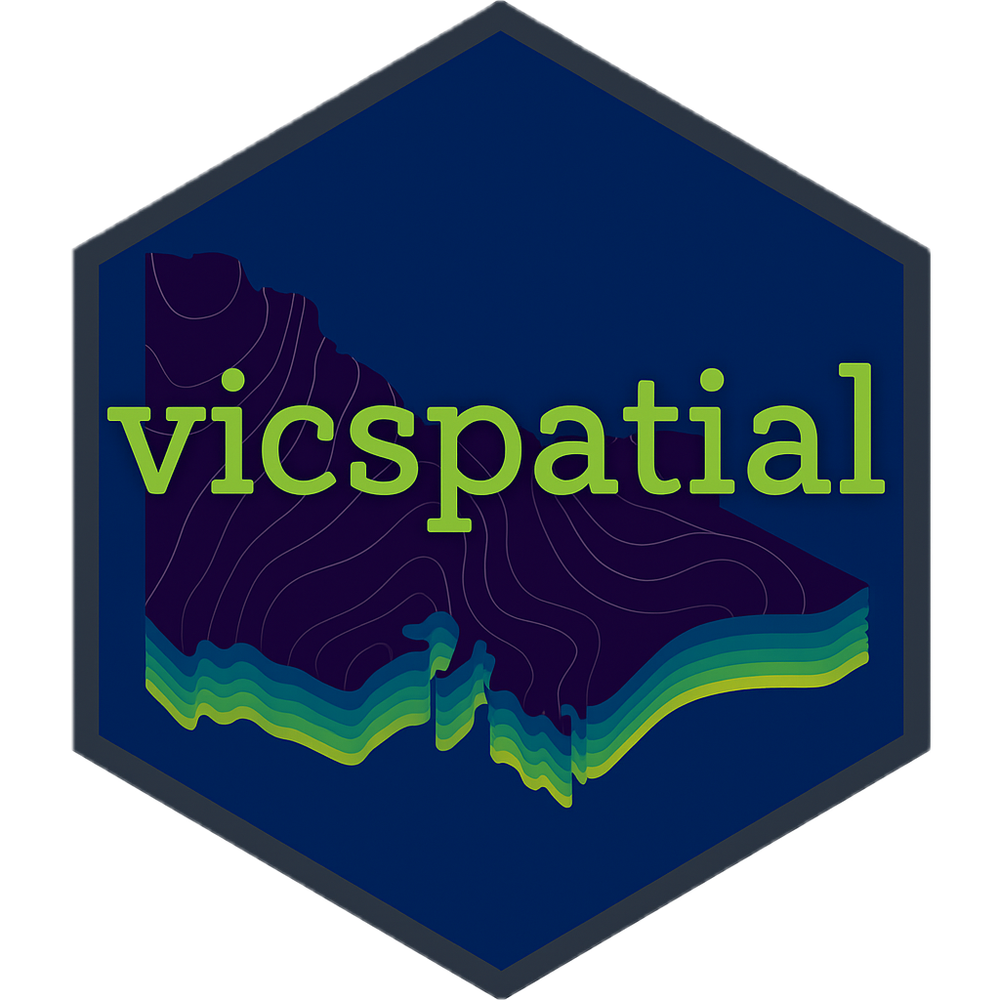

<!-- README.md is generated from README.Rmd. Please edit that file -->

# VicmapR 

<!-- badges: start -->

[](https://app.codecov.io/gh/JustinCally/VicmapR?branch=master)
[](https://lifecycle.r-lib.org/articles/stages.html#stable)
[](https://github.com/JustinCally/VicmapR/actions)
[](https://CRAN.R-project.org/package=VicmapR)
[](https://cran.r-project.org/package=VicmapR)
<!-- [](https://github.com/JustinCally/VicmapR) -->
<!-- [](https://github.com/JustinCally/VicmapR) -->
<!-- badges: end -->

The goal of VicmapR is to provide functions to easily access Victorian
Government spatial data through their WFS (Web Feature Service). VicmapR
leverages code and a lazy querying approach developed by [Teucher et
al. (2021)](https://joss.theoj.org/papers/10.21105/joss.02927) for the
[{bcdata} R package](https://bcgov.github.io/bcdata/), which allows for
a responsive and precise querying process.

## Installation

You can install the released version from CRAN with:

``` r
install.packages("VicmapR")
```

Or you can install the the development version from
[GitHub](https://github.com/) with:

``` r
# install.packages("remotes")
remotes::install_github("JustinCally/VicmapR")
```

### Dependencies

Currently, the ability to use accurate geometric filters using `VicmapR`
requires GDAL &gt; 3.0. To see how to upgrade your version of GDAL and
link it to the `sf` package visit:
<https://r-spatial.github.io/sf/#installing>

``` r
library(sf)
#> Warning: package 'sf' was built under R version 4.1.2
#> Linking to GEOS 3.9.1, GDAL 3.4.0, PROJ 8.1.1; sf_use_s2() is TRUE
sf::sf_extSoftVersion()
#>           GEOS           GDAL         proj.4 GDAL_with_GEOS     USE_PROJ_H 
#>        "3.9.1"        "3.4.0"        "8.1.1"         "true"         "true" 
#>           PROJ 
#>        "8.1.1"
```

## Example

### Searching for data

``` r
library(VicmapR)
#> 
#> Attaching package: 'VicmapR'
#> The following object is masked from 'package:stats':
#> 
#>     filter

# Check to see if the geoserver is working. It will error if it is not working  
check_geoserver()
#> [1] TRUE

listLayers(pattern = "trees", ignore.case = T)
#>                                Name
#> 1 datavic:WATER_ISC2010_LARGE_TREES
#>                                                           Title
#> 1 2010 Index of Stream Condition - Large Trees polygon features
```

### Reading in data

As of VicmapR version `0.1.0` data is read in using a lazy evaluation
method with the convenience of pipe operators (`%>%`). A lot of the
methods and code have already been written for a similar package
([bcdata](https://github.com/bcgov/bcdata)) that downloads data from the
British Columbia WFS catalogues. Using a similar approach, VicmapR
allows users to construct a WFS query in a step-wise format. In doing so
a query is reserved until `collect()` is used on the `vicmap_promise`.
The example below shows an extensive example of how the to easily read
in spatial data:

``` r
# Read in an example shape to restrict our query to using geometric filtering
melbourne <- sf::st_read(system.file("shapes/melbourne.geojson", package="VicmapR"), quiet = T)

# Obtain a promise of what data will be returned for a given layer
vicmap_query(layer = "datavic:VMHYDRO_WATERCOURSE_DRAIN")
#> • Using collect() on this object will return 195432 features and 16
#> • fields
#> • At most six rows of the record are printed here
#> ────────────────────────────────────────────────────────────────────────────────
#> Simple feature collection with 6 features and 15 fields
#> Geometry type: LINESTRING
#> Dimension:     XY
#> Bounding box:  xmin: 142.7675 ymin: -35.06905 xmax: 143.324 ymax: -35.04559
#> Geodetic CRS:  GDA94
#> # A tibble: 6 × 16
#>   id                   PFI    UFI FEATURE_TYPE_CO… NAME  NAMED_FEATURE_ID ORIGIN
#>   <chr>              <int>  <int> <chr>            <chr> <chr>            <chr> 
#> 1 VMHYDRO_WATERCOU… 8.55e6 2.55e6 watercourse_cha… <NA>  <NA>             2     
#> 2 VMHYDRO_WATERCOU… 8.55e6 2.55e6 watercourse_cha… <NA>  <NA>             2     
#> 3 VMHYDRO_WATERCOU… 8.55e6 2.55e6 watercourse_cha… <NA>  <NA>             2     
#> 4 VMHYDRO_WATERCOU… 8.55e6 2.55e6 watercourse_cha… <NA>  <NA>             2     
#> 5 VMHYDRO_WATERCOU… 8.55e6 2.55e6 watercourse_cha… <NA>  <NA>             2     
#> 6 VMHYDRO_WATERCOU… 8.55e6 2.55e6 watercourse_cha… <NA>  <NA>             2     
#> # … with 9 more variables: CONSTRUCTION <chr>, USAGE <chr>, HIERARCHY <chr>,
#> #   FEATURE_QUALITY_ID <int>, CREATE_DATE_PFI <dttm>, SUPERCEDED_PFI <chr>,
#> #   CREATE_DATE_UFI <dttm>, OBJECTID <int>, geometry <LINESTRING [°]>

# Build a more specific query and collect the results
vicmap_query(layer = "datavic:VMHYDRO_WATERCOURSE_DRAIN") %>% # layer to query
  filter(HIERARCHY == "L") %>% # simple filter for a column
  filter(INTERSECTS(melbourne)) %>% # more advanced geometric filter
  select(HIERARCHY, PFI) %>% 
  collect()
#> Note: method with signature 'DBIConnection#character' chosen for function 'dbQuoteIdentifier',
#>  target signature 'wfsConnection#ident'.
#>  "wfsConnection#ANY" would also be valid
#> Note: method with signature 'DBIConnection#character' chosen for function 'dbQuoteIdentifier',
#>  target signature 'wfsConnection#character'.
#>  "wfsConnection#ANY" would also be valid
#> Note: method with signature 'DBIConnection#character' chosen for function 'dbQuoteString',
#>  target signature 'wfsConnection#character'.
#>  "wfsConnection#ANY" would also be valid
#> Simple feature collection with 8 features and 5 fields
#> Geometry type: LINESTRING
#> Dimension:     XY
#> Bounding box:  xmin: 144.909 ymin: -37.81511 xmax: 144.9442 ymax: -37.78198
#> Geodetic CRS:  GDA94
#> # A tibble: 8 × 6
#>   id                     PFI    UFI HIERARCHY OBJECTID                  geometry
#>   <chr>                <int>  <int> <chr>        <int>          <LINESTRING [°]>
#> 1 VMHYDRO_WATERCOURS… 1.46e7 3.63e7 L          1605003 (144.9365 -37.81511, 144…
#> 2 VMHYDRO_WATERCOURS… 1.46e7 3.63e7 L          1582117 (144.929 -37.81409, 144.…
#> 3 VMHYDRO_WATERCOURS… 1.46e7 3.63e7 L          1582120 (144.9288 -37.81417, 144…
#> 4 VMHYDRO_WATERCOURS… 1.46e7 4.90e7 L          2432411 (144.9403 -37.78253, 144…
#> 5 VMHYDRO_WATERCOURS… 1.75e7 4.90e7 L          2432413 (144.9415 -37.78232, 144…
#> 6 VMHYDRO_WATERCOURS… 1.46e7 4.90e7 L          2432415 (144.9442 -37.78198, 144…
#> 7 VMHYDRO_WATERCOURS… 1.93e7 5.44e7 L          2698790 (144.9287 -37.8033, 144.…
#> 8 VMHYDRO_WATERCOURS… 1.46e7 5.44e7 L          2698805 (144.9201 -37.79069, 144…
```

VicmapR translates numerous geometric filter functions available in the
Victorian Government’s WFS Geoserver supports numerous [geometric
filters](https://docs.geoserver.org/stable/en/user/tutorials/cql/cql_tutorial.html#geometric-filters):

-   `EQUALS`  
-   `DISJOINT`  
-   `INTERSECTS`  
-   `TOUCHES`  
-   `CROSSES`  
-   `WITHIN`  
-   `CONTAINS`
-   `OVERLAPS`  
-   `DWITHIN`  
-   `BEYOND`  
-   `BBOX`

These filters can be used within the `filter()` function by providing
them an object of class `sf/sfc/sfg/bbox` as shown above with the
`melbourne` object.

### Using other WFS urls

Using `options(vicmap.base_url)` VicmapR can query data from other WFS
services; while this remains somewhat untested it is relatively easy to
point VicmapR to another WFS url. This option would need to be set every
session to override the base VicmapR url. For instance, the BOM WFS can
be used as follows:

``` r
# set the new base url
options(vicmap.base_url = "http://geofabric.bom.gov.au/simplefeatures/ahgf_shcatch/wfs")

# collect a data sample
catchments <- vicmap_query("ahgf_shcatch:AHGFCatchment") %>% 
  head(10) %>% 
  collect()
```

***Note**: Using other Geoserver WFS urls will not necessarily work as
expected due to the potential differences in the capabilities of the
Geoserver instance*

### License

Copyright 2018 Province of British Columbia  
Modifications Copyright 2020 Justin Cally

Licensed under the Apache License, Version 2.0 (the “License”); you may
not use this file except in compliance with the License. You may obtain
a copy of the License at

<https://www.apache.org/licenses/LICENSE-2.0.txt>

Unless required by applicable law or agreed to in writing, software
distributed under the License is distributed on an “AS IS” BASIS,
WITHOUT WARRANTIES OR CONDITIONS OF ANY KIND, either express or implied.
See the License for the specific language governing permissions and
limitations under the License.
