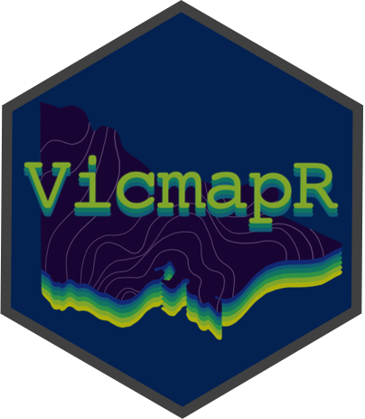

<!-- README.md is generated from README.Rmd. Please edit that file -->

# VicmapR 

<!-- badges: start -->

[](https://codecov.io/gh/JustinCally/VicmapR?branch=master)
[](https://www.tidyverse.org/lifecycle/#maturing)
[](https://github.com/JustinCally/VicmapR/actions)
<!-- badges: end -->

The goal of VicmapR is to provide functions to easily access Victorin
Government spatial data through their WFS (Web Feature Service). The
package is currently in an early development stage.

## Installation

You can install the the development version from
[GitHub](https://github.com/) with:

``` r
# install.packages("remotes")
remotes::install_github("JustinCally/VicmapR")
```

### Dependencies

Currently, the ability to use accurate geometric filters using `VicmapR`
requires GDAL \> 3.0. To see how to upgrade your version of GDAL and
link it to the `sf` package visit:
<https://r-spatial.github.io/sf/#installing>

``` r
library(sf)
#> Linking to GEOS 3.9.0, GDAL 3.2.1, PROJ 7.2.1
sf::sf_extSoftVersion()
#>           GEOS           GDAL         proj.4 GDAL_with_GEOS     USE_PROJ_H 
#>        "3.9.0"        "3.2.1"        "7.2.1"         "true"         "true"
```

## Example

### Searching for data

``` r
library(VicmapR)
#> 
#> Attaching package: 'VicmapR'
#> The following object is masked from 'package:stats':
#> 
#>     filter

listLayers(pattern = "trees", ignore.case = T)
#>                                Name
#> 1 datavic:WATER_ISC2010_LARGE_TREES
#>                                                           Title
#> 1 2010 Index of Stream Condition - Large Trees polygon features
```

### Reading in data

As of VicmapR version `0.1.0` data is read in using a lazy evaluation
method with the convenience of pipe operators (`%>%`). A lot of the
methods and code have already been written for a similar package
([bcdata](https://github.com/bcgov/bcdata)) that downloads data from the
British Columbia WFS catalogue. Using a similar approach to
[bcdata](https://github.com/bcgov/bcdata), VicmapR allows users to
construct a WFS query in a step-wise format. In doing so a query is
reserved until `collect()` is used on the `vicmap_promise`. The example
below shows an extensive example of how the to easily read in spatial
data:

``` r
# Read in an example shape to restrict our query to using geometric filtering
melbourne <- sf::st_read(system.file("shapes/melbourne.geojson", package="VicmapR"), quiet = T)

# Obtain a promise of what data will be returned for a given layer
vicmap_query(layer = "datavic:VMHYDRO_WATERCOURSE_DRAIN")
#> ● Using collect() on this object will return 187446 features and 16
#> ● fields
#> ● At most six rows of the record are printed here
#> ────────────────────────────────────────────────────────────────────────────────────────────────────────────────
#> Simple feature collection with 6 features and 15 fields
#> geometry type:  LINESTRING
#> dimension:      XY
#> bbox:           xmin: 142.7675 ymin: -35.06905 xmax: 143.324 ymax: -35.04559
#> geographic CRS: GDA94
#> # A tibble: 6 x 16
#>   id       PFI    UFI FEATURE_TYPE_CO… NAME  NAMED_FEATURE_ID ORIGIN
#>   <chr>  <int>  <int> <chr>            <chr> <chr>            <chr> 
#> 1 VMHY… 8.55e6 2.55e6 watercourse_cha… <NA>  <NA>             2     
#> 2 VMHY… 8.55e6 2.55e6 watercourse_cha… <NA>  <NA>             2     
#> 3 VMHY… 8.55e6 2.55e6 watercourse_cha… <NA>  <NA>             2     
#> 4 VMHY… 8.55e6 2.55e6 watercourse_cha… <NA>  <NA>             2     
#> 5 VMHY… 8.55e6 2.55e6 watercourse_cha… <NA>  <NA>             2     
#> 6 VMHY… 8.55e6 2.55e6 watercourse_cha… <NA>  <NA>             2     
#> # … with 9 more variables: CONSTRUCTION <chr>, USAGE <chr>,
#> #   HIERARCHY <chr>, FEATURE_QUALITY_ID <int>, CREATE_DATE_PFI <dttm>,
#> #   SUPERCEDED_PFI <chr>, CREATE_DATE_UFI <dttm>, OBJECTID <int>,
#> #   geometry <LINESTRING [°]>

# Build a more specific query and collect the results
vicmap_query(layer = "datavic:VMHYDRO_WATERCOURSE_DRAIN") %>% # layer to query
  filter(HIERARCHY == "L") %>% # simple filter for a column
  filter(INTERSECTS(melbourne)) %>% # more advanced geometric filter
  select(HIERARCHY, PFI) %>% 
  collect()
#> The object is too large to perform exact spatial operations using VicmapR. 
#>             To simplify the polygon, sf::st_simplify() was used to reduce the size of the queryFALSE
#> although coordinates are longitude/latitude, st_union assumes that they are planar
#> although coordinates are longitude/latitude, st_union assumes that they are planar
#> Simple feature collection with 8 features and 5 fields
#> geometry type:  LINESTRING
#> dimension:      XY
#> bbox:           xmin: 144.909 ymin: -37.81511 xmax: 144.9442 ymax: -37.78198
#> geographic CRS: GDA94
#> # A tibble: 8 x 6
#>   id            PFI    UFI HIERARCHY OBJECTID                      geometry
#>   <chr>       <int>  <int> <chr>        <int>              <LINESTRING [°]>
#> 1 VMHYDRO_W… 1.46e7 3.63e7 L          1605003 (144.9365 -37.81511, 144.935…
#> 2 VMHYDRO_W… 1.46e7 3.63e7 L          1582117 (144.929 -37.81409, 144.9294…
#> 3 VMHYDRO_W… 1.46e7 3.63e7 L          1582120 (144.9288 -37.81417, 144.929…
#> 4 VMHYDRO_W… 1.46e7 4.90e7 L          2432411 (144.9403 -37.78253, 144.940…
#> 5 VMHYDRO_W… 1.75e7 4.90e7 L          2432413 (144.9415 -37.78232, 144.941…
#> 6 VMHYDRO_W… 1.46e7 4.90e7 L          2432415 (144.9442 -37.78198, 144.944…
#> 7 VMHYDRO_W… 1.93e7 5.44e7 L          2698790 (144.9287 -37.8033, 144.9186…
#> 8 VMHYDRO_W… 1.46e7 5.44e7 L          2698805 (144.9201 -37.79069, 144.920…
```

### Using other WFS urls

Using `options(vicmap.base_url)` VicmapR can query data from other WFS
services; while this remains somewhat untested it is relatively easy to
point VicmapR to another WFS url. This option would need to be set every
session to override the base VicmapR url. For instance, the BOM WFS can
be used as follows:

``` r
# set the new base url
options(vicmap.base_url = "http://geofabric.bom.gov.au/simplefeatures/ahgf_shcatch/wfs")

# list available data
listLayers()

# collect a data sample
catchments <- vicmap_query("ahgf_shcatch:AHGFCatchment") %>% 
  head(10) %>% 
  collect()

str(catchments)
```
